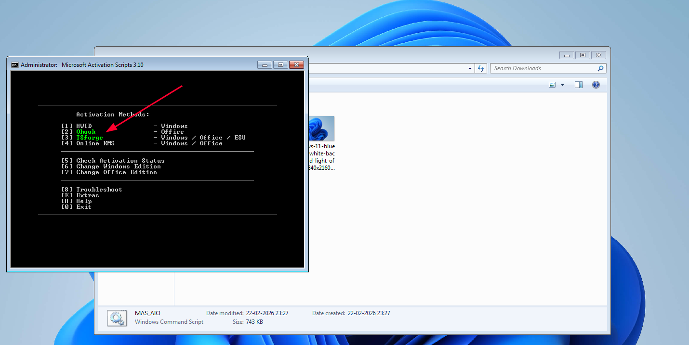

# Setting Up a Windows 7 Sandbox VM with VirtualBox

This guide will walk you through creating a Windows 7 virtual machine for sandbox testing, including activation using Microsoft Activation Scripts (MAS). Follow each step carefully to set up a functional, isolated environment for your mini project.

> **⚠️ Disclaimer**  
> This guide is intended for educational and testing purposes only. Windows 7 is no longer supported by Microsoft, and activation using third‑party tools may violate licensing terms. Use this VM only in a sandboxed environment, and ensure you comply with all applicable laws and regulations.

---

## 1. Prerequisites

Before starting, install **VirtualBox** and the **Extension Pack** on your host machine.

### 1.1 Install VirtualBox
- Download VirtualBox from [https://www.virtualbox.org/](https://www.virtualbox.org/) (choose the package for your host OS).
- Run the installer and follow the on‑screen instructions.

### 1.2 Install VirtualBox Extension Pack
- Download the same version Extension Pack from the VirtualBox downloads page.
- Open VirtualBox, go to **File > Preferences > Extensions**.
- Click the add icon (➕) and select the downloaded `.vbox-extpack` file.
- Accept the license to install.

The Extension Pack adds support for USB 2.0/3.0, Remote Desktop, and other features, but it's not strictly required for this guide. However, it’s good practice to have it installed.

---

## 2. Create the Virtual Machine

1. Open VirtualBox and click **New**.
2. Set the following options:
   - **Name:** `Windows 7 Sandbox` (or any name you prefer)
   - **Type:** `Microsoft Windows`
   - **Version:** `Windows 7 (64‑bit)` (if you downloaded the 64‑bit ISO)
3. Click **Next**.

### 2.1 Memory Size
- Set **2048 MB** to **3072 MB** (approx. 3 GB).  
  *We recommend 3072 MB for smooth performance.*
- Click **Next**.

### 2.2 Hard Disk
- Select **Create a virtual hard disk now** → **Create**.
- Choose **VDI (VirtualBox Disk Image)** → **Next**.
- Choose **Dynamically allocated** → **Next**.
- Set the size to **25–40 GB** (enough for Windows 7 and basic software).  
  *Dynamically allocated means the file will only grow as space is used.*
- Click **Create**.

### 2.3 Adjust Processor Count
- With the VM selected, click **Settings** → **System** → **Processor**.
- Set **Processor(s)** to `2` (or less, depending on your host’s capabilities).

### 2.4 Enable Bidirectional Clipboard & Drag‑and‑Drop
- Go to **General** → **Advanced**.
- Set **Shared Clipboard** to `Bidirectional`.
- Set **Drag’n’Drop** to `Bidirectional`.

### 2.5 Attach the Windows 7 ISO
- Go to **Storage**.
- Under **Controller: IDE**, click the empty **Optical Drive**.
- In the **Attributes** panel, click the disk icon next to **Optical Drive** and choose **Choose a disk file…**.
- Browse and select the Windows 7 ISO file you downloaded (see step 3).

---

## 3. Download Windows 7 ISO

You can obtain a Windows 7 Service Pack 1 ISO from [massgrave.dev](https://massgrave.dev/windows_7_links).  
For a direct download of **Windows 7 Ultimate SP1 (64‑bit)**, use this link:  
[https://massgrave.dev/drive.html#en_windows_7_ultimate_with_sp1_x64_dvd_u_677332.iso](https://massgrave.dev/drive.html#en_windows_7_ultimate_with_sp1_x64_dvd_u_677332.iso)

> **Note:** The download may take some time. Verify the SHA‑1 hash if you wish to ensure integrity.

---

## 4. Install Windows 7

1. Start the VM (click **Start**). It will boot from the attached ISO.
2. When prompted, press any key to boot from DVD.
3. Select your language, time format, and keyboard layout. Click **Next**.
4. Click **Install now**.
5. Accept the license terms and click **Next**.
6. Choose **Custom (advanced)** installation type.
7. You’ll see the unallocated space of your virtual disk. Click **Next** (Windows will create the necessary partitions automatically).
8. Windows will begin copying files and installing. The VM will reboot several times – do not interrupt it.
9. After installation, you’ll be asked for a product key. **Click “Skip”** (you can enter a key later, but we’ll activate with MAS instead).
10. Set up a username and computer name. A password is optional.
11. Choose your update settings (recommended: “Use recommended settings” or “Ask me later”).
12. Set your time zone and confirm.
13. Once done, Windows 7 will start. You may see a “Network” prompt – select **Home network** (or whatever suits your sandbox).

---

## 5. Install VirtualBox Guest Additions

Guest Additions improve performance and enable features like bidirectional clipboard and drag‑and‑drop.

1. In the VM window, go to the **Devices** menu and select **Insert Guest Additions CD image…**.
2. Inside the VM, open **Computer** (or This PC) and double‑click the CD drive labeled **VirtualBox Guest Additions**.
3. Run `VBoxWindowsAdditions.exe` (right‑click and choose **Run as administrator** if needed).
4. Follow the installer, accepting defaults. When asked about Direct3D support, you can leave it unchecked.
5. After installation, reboot the VM when prompted.

After reboot, clipboard sharing and drag‑and‑drop should work between host and guest.

---

## 6. Activate Windows 7 Using MAS

[MAS (Microsoft Activation Scripts)](https://massgrave.dev/) provides a simple, open‑source method to activate Windows.

1. Inside the VM, open a web browser and download the **MAS_AIO.cmd** script from the following direct link:  
   [https://dev.azure.com/massgrave/Microsoft-Activation-Scripts/_apis/git/repositories/Microsoft-Activation-Scripts/items?path=/MAS/All-In-One-Version-KL/MAS_AIO.cmd&download=true](https://dev.azure.com/massgrave/Microsoft-Activation-Scripts/_apis/git/repositories/Microsoft-Activation-Scripts/items?path=/MAS/All-In-One-Version-KL/MAS_AIO.cmd&download=true)

2. Once downloaded, **right‑click** the file and select **Run as administrator**.  
   (If Windows SmartScreen warns you, click **More info** and then **Run anyway**.)

3. A command window will open with several activation options.  
   - The option highlighted in **green** is the recommended one (usually option **1** for HWID activation, which permanently activates Windows 7 based on your hardware).  
   - Type the corresponding number and press **Enter**.

4. The script will run automatically. Wait for it to complete – you’ll see messages indicating success.

5. Once finished, close the command window and **restart the VM**.

6. After reboot, verify activation:  
   - Go to **Start** → right‑click **Computer** → **Properties**.  
   - Scroll down to the **Windows activation** section – it should say “Windows is activated”.

---

## 7. Optional Post‑Installation Tweaks

- **Install Updates:** Windows 7 may try to download many updates. In a sandbox, you can disable Windows Update or limit updates to critical ones to save time.
- **Create a Snapshot:** Once everything is set up, take a snapshot in VirtualBox. This lets you revert to a clean state after testing.

---

## 8. Troubleshooting

- **VM won’t boot from ISO:** Ensure the ISO is attached in Storage settings and the boot order has the optical drive first (under **System** → **Motherboard** → **Boot Order**).
- **Guest Additions fail to install:** Try running the installer in compatibility mode (right‑click → **Properties** → **Compatibility** → run as Windows 7).
- **Activation script errors:** Make sure you’re running it as administrator and that the VM has internet access (NAT works out of the box). Disable any host firewall temporarily if needed.

